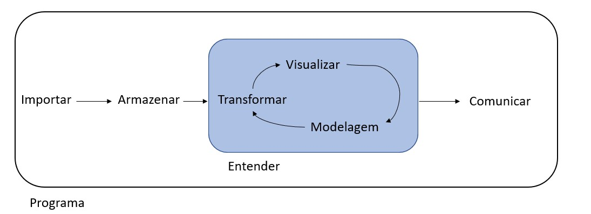
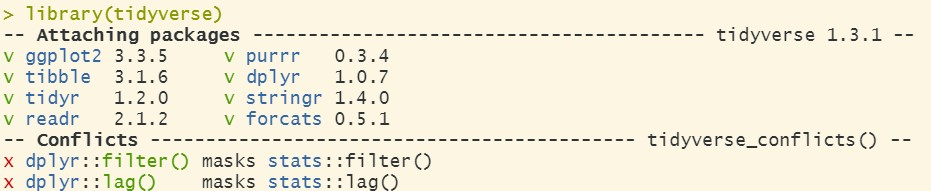

```{r, include = F}
# This is the recommended set up for flipbooks
# you might think about setting cache to TRUE as you gain practice --- building flipbooks from scratch can be time consuming
knitr::opts_chunk$set(fig.width = 9, 
                      fig.height= 5.5,  
                      fig.retina = 3, 
                      message = FALSE, 
                      warning = FALSE, 
                      comment = "", 
                      cache = F, 
                      out.width = "100%")
library(flipbookr)
library(tidyverse)
library(gapminder)
```

# Mineração de Dados

--

Nesta apresentação vamos ver passo a passo algumas das atividades comuns que são necessárias quando estamos nos preparando para desenvolver um modelo.

--

Vamos inicialmente utilizar o pacote `tidyverse` que é na realidade um conjunto de pacotes que permite a importação, manipulação e a visualização de um conjunto de dados. 

--

Neste exemplo vamos usar dados contidos no pacote `gapminder` que possui informação sobre países, por exemplo, população, PIB, etc.

--

A base de dados possui `r  nrow(gapminder)` linhas

--

Vamos realizar algumas atividades básicas que podem ser estendidas para qualquer conjunto de dados.  

---

# O que vamos fazer

--



---

# Carregando o tidyverse

--

`r chunk_reveal("ex_1")`

```{r ex_1, echo=TRUE, include=F}
library(tidyverse)
```



---

# Carregando o gapminder

--

`r chunk_reveal("ex_1A")`

```{r ex_1A, include=F}
library(gapminder)
```

---

# Carregando os dados

--

`r chunk_reveal("ex_2")`

```{r ex_2, include = FALSE}
data(gapminder) 
```

---

layout: true
# Conhecendo os dados

---

`r chunk_reveal("ex_2A")`

```{r ex_2A, include = FALSE}
class(gapminder) # tipo de dados
```

---

`r chunk_reveal("ex_2B")`

```{r ex_2B, include = FALSE}
str(gapminder) # estrutura dos dados
```

---

`r chunk_reveal("ex_2C")`

```{r ex_2C, include = FALSE}
summary(gapminder)  
```

---

layout: false
# Outras opções

--

`r chunk_reveal("ex_3")`

```{r ex_3, include = FALSE}
glimpse(gapminder) 
```

---

# Outras opções

--

`r chunk_reveal("ex_3A")`

```{r ex_3A, include = FALSE}
head(gapminder) # linhas iniciais do conjunto de dados
```


---
# Dados do gapminder - Colunas

--

- country = país

--

- continent = continente

--

- year = ano

--

- lifeExp = expectativa de vida (em anos)

--

- pop = população

--

- gdpPercap = PIB per capita (US$)

---

# Filtrando os dados

--

`r chunk_reveal("ex_4")`

```{r ex_4, include = FALSE}
## Criar um extrato do ano de 2007
gap_07 <- filter(gapminder, year == 2007)  
```

---

# Filtrando os dados

--

`r chunk_reveal("ex_4A")`

```{r ex_4A, include = FALSE}
## Criar um extrato do ano de 2007
head(gap_07)
```

---

layout: true
# Manipulação de dados

---

Vamos renomear os nomes das colunas para o português

--

`r chunk_reveal("ex_5")`

```{r ex_5, include = FALSE}
gap_07_p <- rename(gap_07, pais = country, continente = continent,ano = year, 
                 expVida = lifeExp, pibPercap = gdpPercap) 
```

---

`r chunk_reveal("ex_5A")`

```{r ex_5A, include = FALSE}
knitr::kable(head(gap_07_p, 10), booktabs = TRUE, format = 'html')

```

---

`r chunk_reveal("ex_5B")`

```{r ex_5B, include = FALSE}
gt::gt(head(gap_07_p, 10))
```

---
layout: false
# Ordenando pelo PIB

--

`r chunk_reveal("ex_6")`

```{r ex_6, include = FALSE}
# crescente
gap_07_p %>% arrange(pibPercap) 
```

---

# Ordenando pelo PIB

--

`r chunk_reveal("ex_6A")`

```{r ex_6A, include = FALSE}
# descrescente
gap_07_p %>% arrange(desc(pibPercap))
```


---

# Selecionando colunas

--

`r chunk_reveal("ex_7")`

```{r ex_7, include = FALSE}
gap_07_p %>% select(expVida, pibPercap) #selecionando 2 colunas
```

---

layout: true

# Criando colunas com mutate

---

`r chunk_reveal("ex_8")`

```{r ex_8, include = FALSE}
gap_07_p %>% 
         mutate(expVida_meses = expVida * 12) 
```

---

layout:true
# Usando o ggplot2

---

## Criar um gráfico de dispersão do PIB vs. Expectativa de Vida

--

`r chunk_reveal("ex_9")`

```{r ex_9, include=FALSE}
ggplot(gap_07_p, aes(x = pibPercap, y = expVida)) +
  geom_point()
```

---

## Criar um gráfico de barras

--

`r chunk_reveal("ex_10")`

```{r ex_10, include=FALSE}
ggplot(gap_07_p, aes(x = continente)) +
  geom_bar()
```

---
layout: true
# Calculando a mediana da população com **summarize** 

---

`r chunk_reveal("ex_11")`

```{r ex_11, include=FALSE}
gap_07_med <- gap_07_p %>%
             group_by(continente) %>%
             summarize(pop = median(pop))
gap_07_med
```

---
layout: true
# Gráficos de Barra 

---

`r chunk_reveal("ex_12")`

```{r ex_12, include=FALSE}
ggplot(gap_07_med, aes(x = continente, y = pop)) +
  geom_bar(stat = "identity")
```

---

`r chunk_reveal("ex_13")`

```{r ex_13, include=FALSE}
ggplot(gap_07_med, aes(x = continente, y = pop)) +
  geom_bar(stat = "identity", width = 0.5)
```

---

`r chunk_reveal("ex_14")`

```{r ex_14, include=FALSE}
ggplot(gap_07_med, aes(x = continente, y = pop)) +
  geom_bar(stat = "identity", width = 0.5, color="blue", fill="white")
```

---

`r chunk_reveal("ex_15")`

```{r ex_15, include=FALSE}
ggplot(gap_07_med, aes(x = continente, y = pop)) +
  geom_bar(stat = "identity", width = 0.5, color="blue", fill="grey")+
  geom_text(aes(label=pop), vjust=-1.6, color="black", size=3) +
  scale_y_continuous(limits = c(0,3.0e+07))
```

---

layout: true
# Filtrando o Brasil 

---

`r chunk_reveal("ex_16")`

```{r ex_16, include=FALSE}
gap_brasil <- filter(gapminder, country == "Brazil")
```

---

`r chunk_reveal("ex_17")`

```{r ex_17, include=FALSE}
p <- ggplot(gap_brasil, aes(x = year, y = gdpPercap))
p + 
  geom_point()
```
 
---

`r chunk_reveal("ex_18")`

```{r ex_18, include=FALSE}
p + 
  geom_line()
```
 
---

`r chunk_reveal("ex_19")`

```{r ex_19, include=FALSE}
p + 
  geom_point() + 
  geom_line()
```

---
layout:false
class: inverse, middle, center
# FIM

<!-- adjust font size in this css code chunk, currently 90 -->

```{css, eval = TRUE, echo = FALSE}
.remark-code{line-height: 1.5; font-size: 90%}

@media print {
  .has-continuation {
    display: block;
  }
}

code.r.hljs.remark-code{
  position: relative;
  overflow-x: hidden;
}


code.r.hljs.remark-code:hover{
  overflow-x:visible;
  width: 500px;
  border-style: solid;
}
```


